# Florin

**Bookkeeping for Dutch freelancers (ZZP), built for the desktop.**

Florin handles your invoices, expenses, VAT returns, tax estimate, hours, mileage, assets, and pension allowance — all in one place, entirely offline. No subscription. No account. No cloud. Your data stays on your machine.

Available in Dutch and English.

---

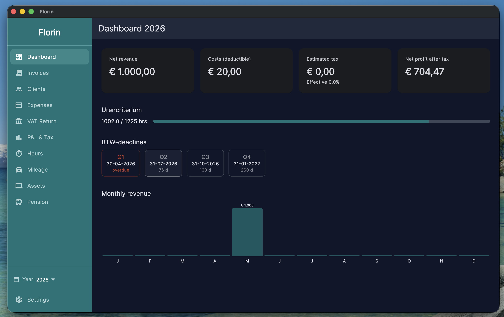

---

## Features

### Invoicing
Create professional PDF invoices with automatic numbering. Supports regular invoices, credit notes, ICP (intracommunautaire prestaties), and BTW-verlegd. Track status: Draft, Sent, Paid, Cancelled, Refunded, Overdue.

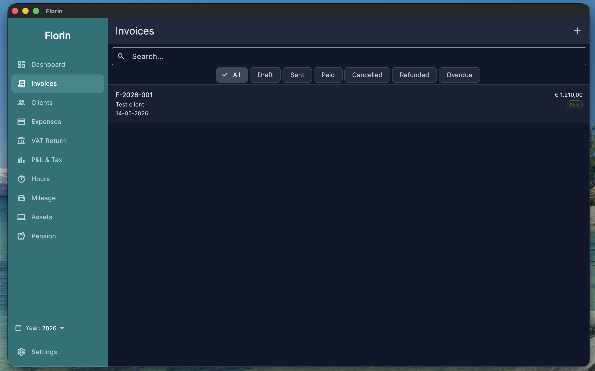 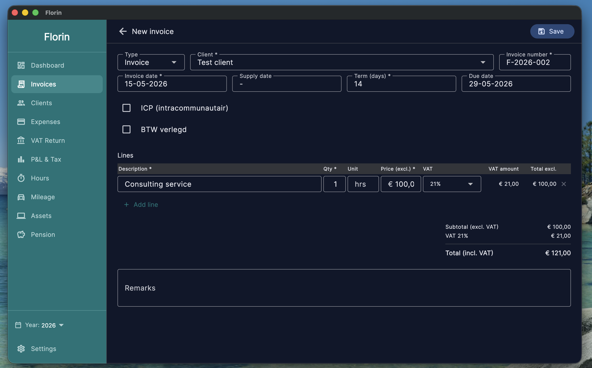

### Expenses
Log business expenses by category with VAT reclaim, business use percentage for mixed costs, and receipt tracking.

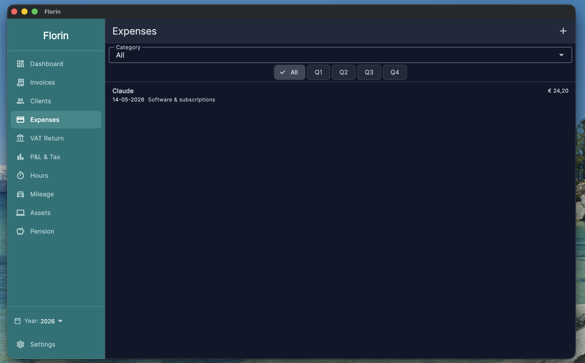 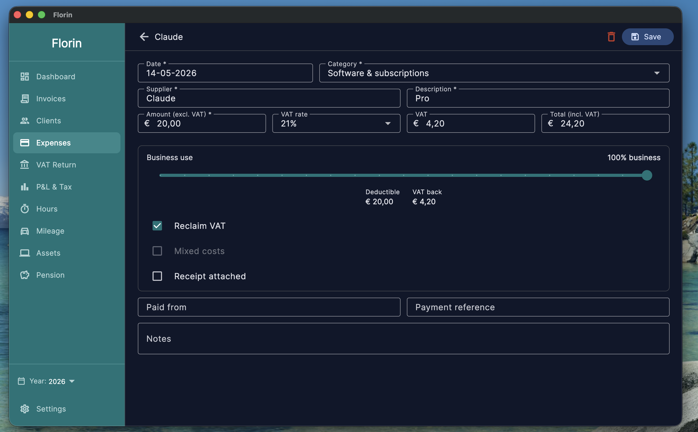

### VAT Return (BTW-aangifte)
Quarterly BTW return pre-filled from your invoices and expenses. Covers all standard fields: 1a/1b/1c, 3a (ICP), 5a/5b. Track filing and payment status per quarter.

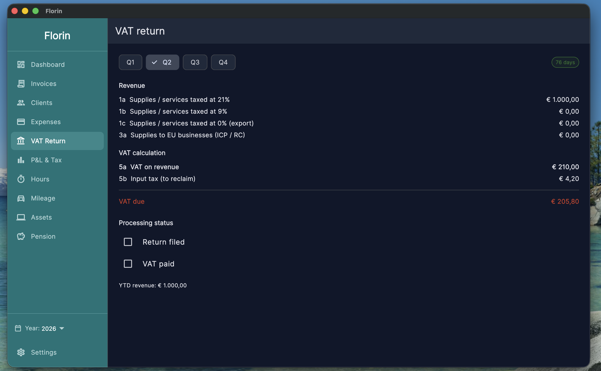

### P&L and Tax Estimate
Real-time income tax calculation with all Dutch deductions applied:

- Zelfstandigenaftrek
- Startersaftrek (first 3 years)
- MKB-winstvrijstelling (12.7%)
- KIA / EIA / MIA investment deductions
- Car mileage allowance (€0.23/km)
- Asset depreciation
- Pension (lijfrente) deduction
- Algemene heffingskorting and arbeidskorting

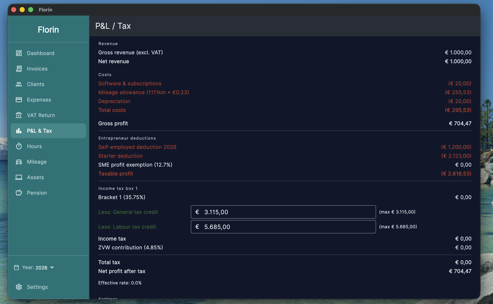

### Hour Registration (Urencriterium)
Track billable and non-billable hours per client and project. Progress bar shows your urencriterium status (1,225 hrs/year) — required for the zelfstandigenaftrek.

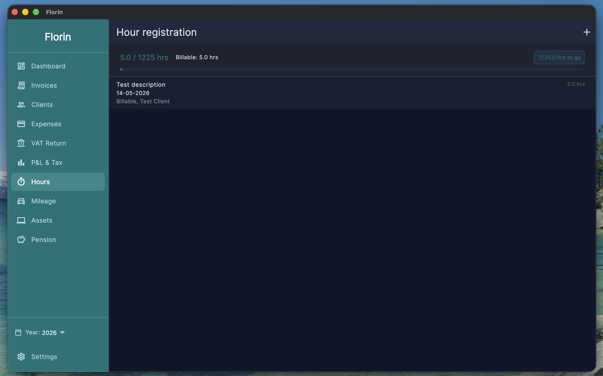

### Mileage Registration
Log business trips with make, licence plate, odometer readings, and purpose. Calculates your total deductible allowance at €0.23/km.

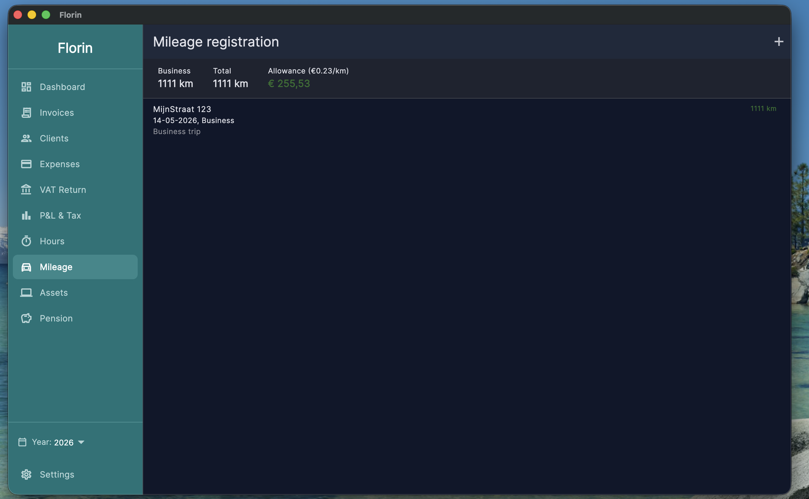

### Fixed Assets
Track capital investments with straight-line depreciation, business use percentage, and KIA / EIA / MIA eligibility. Depreciation feeds directly into your tax calculation.

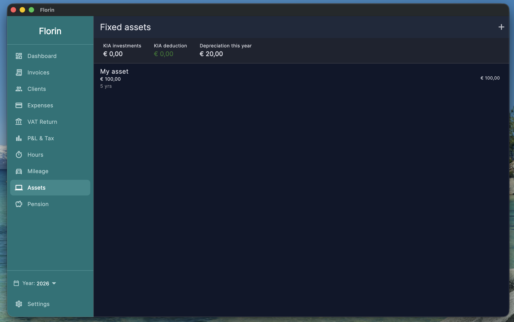

### Pension (Jaarruimte)
Calculate your annual pension contribution allowance (30% rule) including AOW franchise, Factor A, and unused allowance from prior years. Planned contributions are deducted from your taxable income.

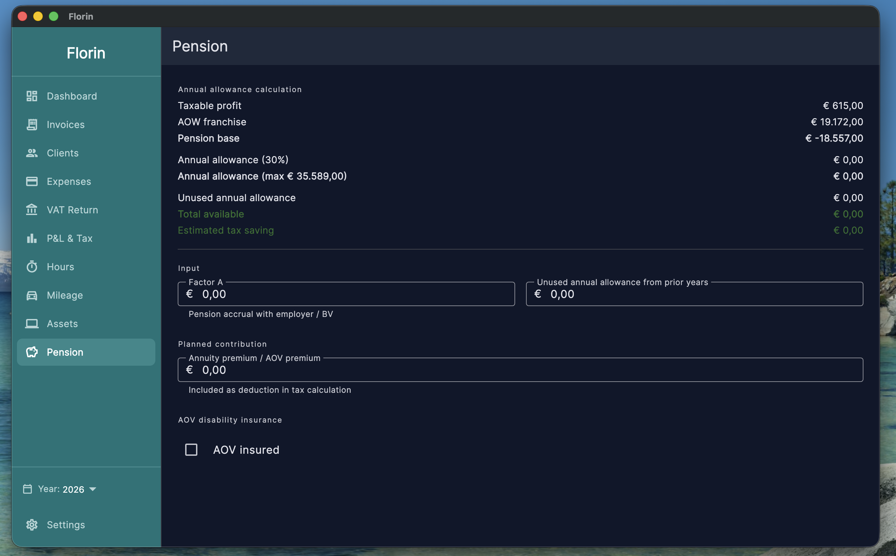

### Client Management
Manage your client list with VAT number, KVK number, contact details, and Wet DBA risk level. Track contract status per client.

### Settings
Set your business name, VAT number, KVK number, IBAN, and language (Dutch or English). Startersaftrek eligibility can be toggled to apply the additional deduction automatically.

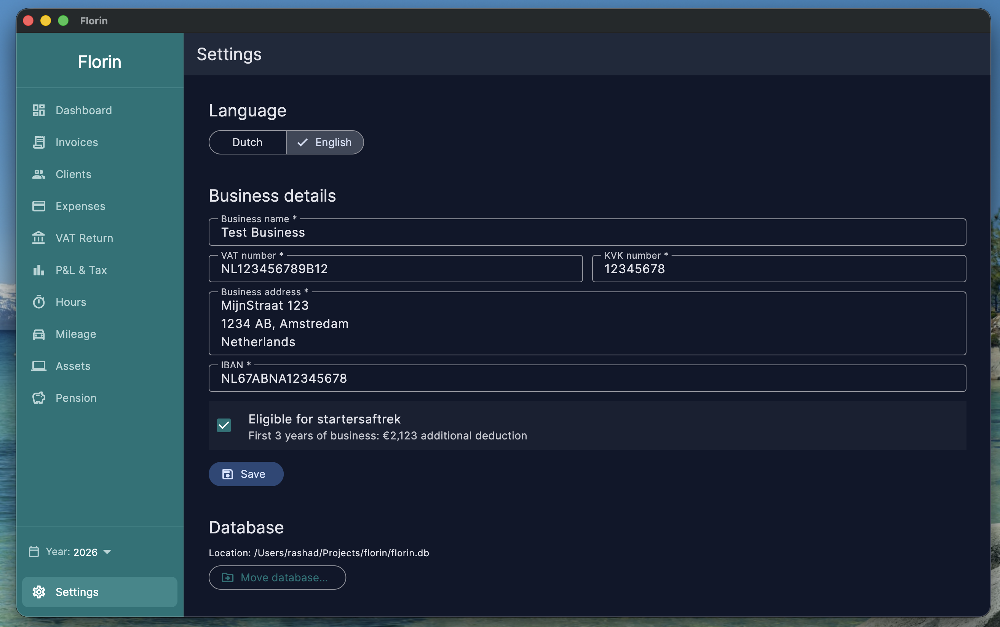

---

## Download

Get the latest release for your platform from the [Releases](../../releases) page.

| Platform | File |
|---|---|
| macOS | `florin-macos.zip` |
| Windows | `florin-windows-x64.zip` |
| Linux | `florin-linux-x64.tar.gz` |

### macOS

1. Unzip `florin-macos.zip`
2. Move `Florin.app` to your Applications folder
3. Right-click `Florin.app` and choose **Open**
4. Click **Open** in the dialog that appears

If you see "damaged and can't be opened", run this in Terminal:
```sh
xattr -cr /Applications/Florin.app
```

### Windows

1. Unzip `florin-windows-x64.zip`
2. Run `florin.exe`
3. If Windows SmartScreen appears, click **More info** then **Run anyway**

### Linux

1. Extract `florin-linux-x64.tar.gz` to a folder, e.g. `~/.local/lib/florin/`
2. Run `./florin`

To add Florin to your app launcher, copy `data/florin.desktop` to `~/.local/share/applications/` and update the `Exec=` path.

---

## Build from source

**Requirements:** Flutter stable channel, Dart SDK ^3.11

```sh
git clone https://github.com/RashadAnsari/florin.git
cd florin
flutter pub get
flutter run -d macos   # or -d windows, -d linux
```

---

## Tech stack

- [Flutter](https://flutter.dev) — cross-platform UI
- [Drift](https://drift.simonbinder.eu) — local SQLite database
- [Riverpod](https://riverpod.dev) — state management
- [pdf](https://pub.dev/packages/pdf) + [printing](https://pub.dev/packages/printing) — invoice PDF generation
- [go_router](https://pub.dev/packages/go_router) — navigation

---

## Disclaimer

Florin is provided as a tool to help you organise your financial records. It is not a substitute for professional tax or legal advice.

The tax calculations, deductions, and figures shown in Florin are estimates based on publicly available Dutch tax rules. They may be incomplete, outdated, or not applicable to your specific situation. Always verify your tax obligations with a qualified accountant (boekhouder) or tax advisor before filing with the Belastingdienst.

The author accepts no liability for errors in calculations, missed deadlines, incorrect filings, financial loss, or any other consequence arising from the use of this software. Use Florin at your own risk.
